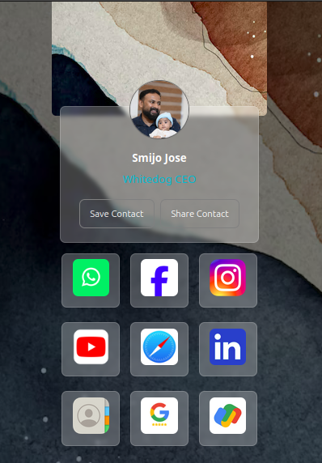

# 🏷️ Whitetap Demo App




This test web application is designed for a client to consolidate all his social links in one place, similar to Linktree. Despite its simplicity, this application has high potential. Once the coding is done, the client can then host it and write the URL to a MIFARE Classic NFC card. All his social links can be shared with just a tap on NFC-enabled devices.

---

## 🌟 Features

- **Save Contact**: Download the client's contact as a vCard (.vcf).
- **Share Contact**: Open WhatsApp with a prewritten message.
- **Direct Links**: Quick access to various social media profiles and contact options.

---

## 🛠️ Technologies Used

- **HTML**: Structure
- **CSS**: Styling
- **JavaScript**: Interactivity

---

## 📋 Usage

1. **Save Contact**: Click "Save Contact" to download vCard.
2. **Share Contact**: Click "Share Contact" to open WhatsApp.
3. **Social Media**: Click icons to open respective platforms.

---

## 🧩 Code Overview

### HTML

- Structured layout with profile card, contact buttons, and social media links.

### CSS

- Styled using external CSS (`styles.css`).

### JavaScript

- **`shareContact`**: Opens WhatsApp with a prewritten message.
- **`openURL`**: Handles URL redirection based on the protocol.
- **`generateVCard`**: Creates and downloads a vCard with contact info.

---

## 📦 Installation

1. Clone the repository:
    ```sh
    git clone https://github.com/yourusername/whitetap-demo-app.git
    ```
2. Navigate to the project directory:
    ```sh
    cd whitetap-demo-app
    ```
3. Open `index.html` in your preferred browser.

---

## 🚀 Demo

The finished version is now available for purchase at [www.thewhitetap.com](https://www.thewhitetap.com). You can also view a sample profile at [www.thewhitetap.com/profile/1](https://www.thewhitetap.com/profile/1).

---

## 📈 Future Enhancements

- Add more social links and functionalities.
- Improve UI/UX based on user feedback.
- Implement a backend for dynamic content management.

---


## 👤 Contact

For any inquiries or issues, please contact [jagannath p s](mailto:jagannathps2000@gmail.com).

